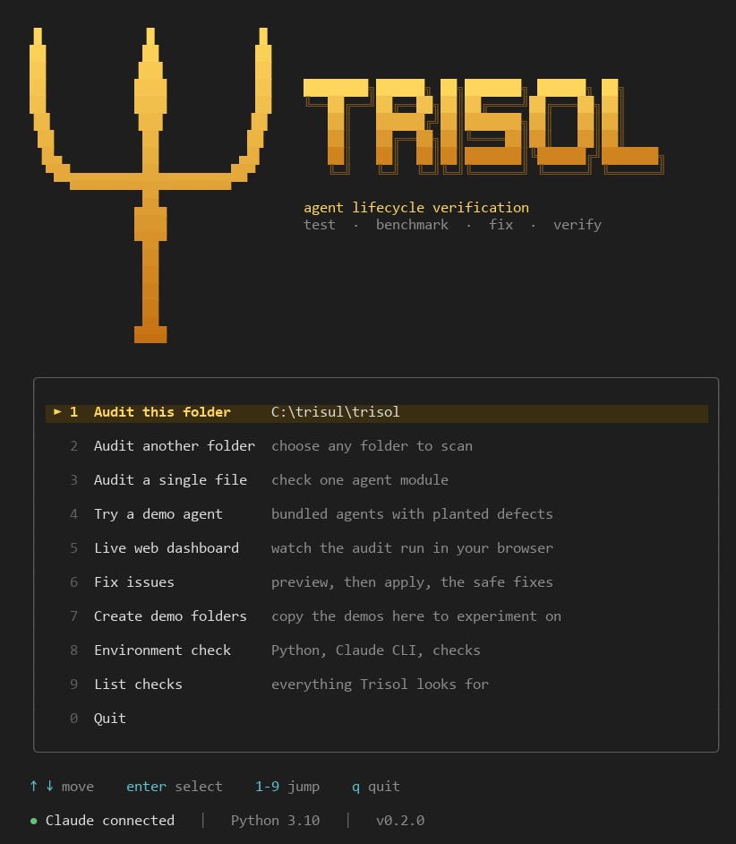
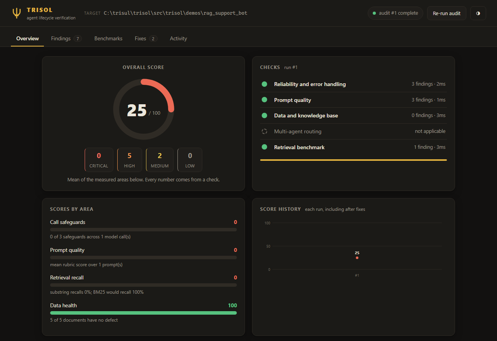
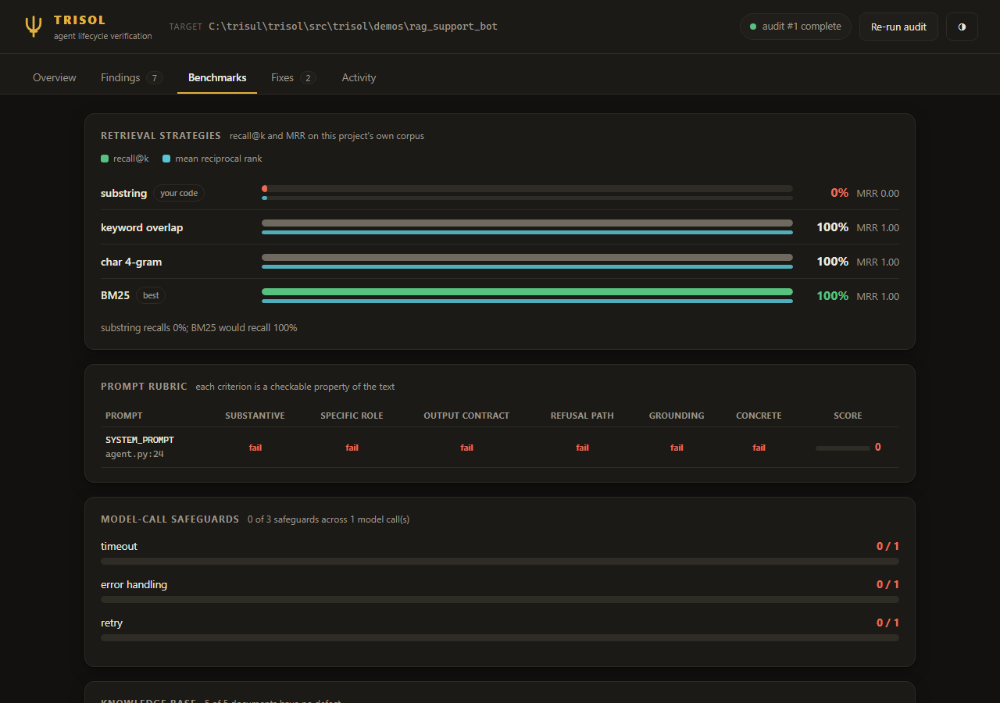
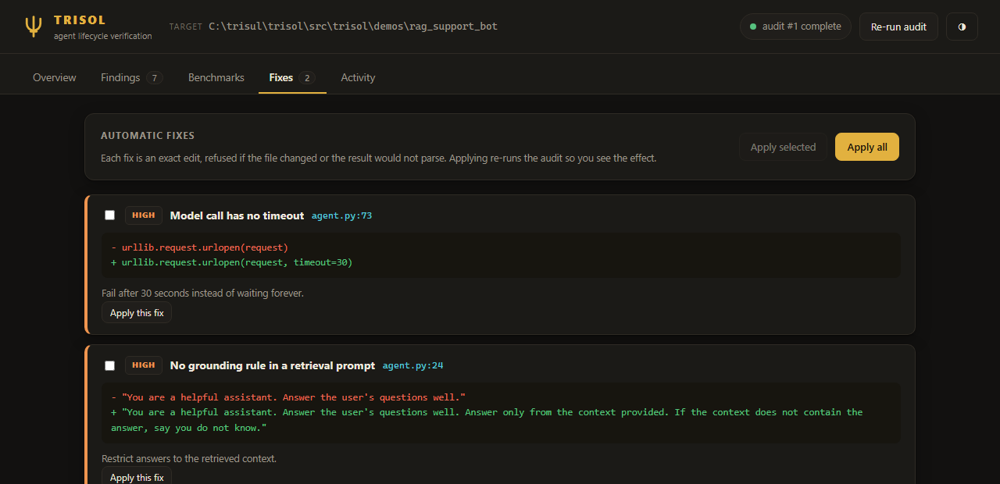
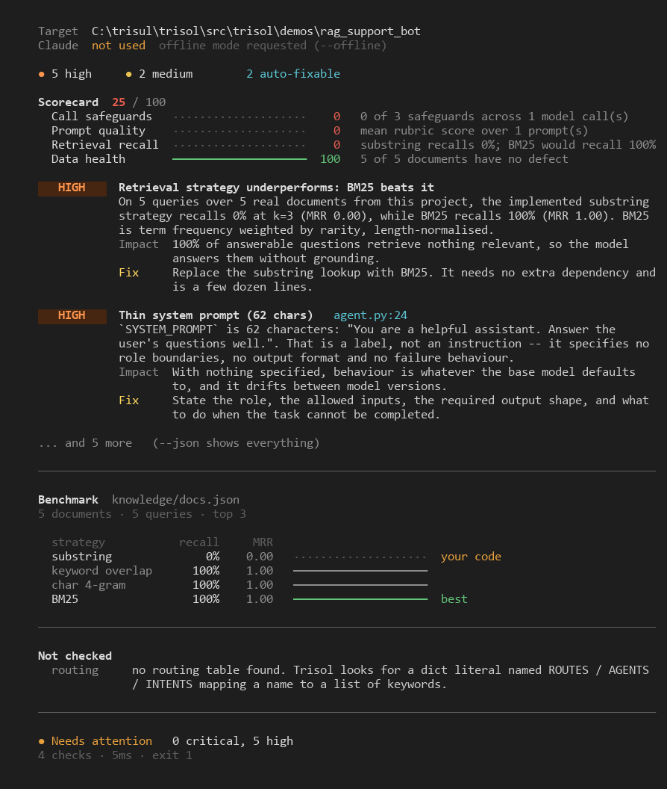

<p align="center">
  
</p>

<h1 align="center">Trisol</h1>

<p align="center"><b>Agent lifecycle verification.</b><br>
Point it at an AI agent codebase. It tests what the code actually does, benchmarks it,
shows you the fixes, applies them, and verifies the result.</p>

<p align="center">
  <code>test</code> &nbsp;·&nbsp; <code>benchmark</code> &nbsp;·&nbsp; <code>fix</code> &nbsp;·&nbsp; <code>verify</code>
</p>

---

## Quick start

```bash
pip install -e .
cd path/to/your/agent
trisol                 # interactive menu -> "Audit this folder"
```

Or run a command directly:

```bash
trisol audit .               # test and benchmark; report in the terminal
trisol serve .               # live web dashboard, opens before the audit runs
trisol fix . --apply         # write the safe automatic fixes into your files
trisol demo rag_support_bot  # try it on a bundled agent with planted defects
```

Python 3.10+. **No runtime dependencies.**

> **Windows / multiple Python installs:** `pip install -e .` installs `trisol` into whichever
> Python ran `pip`. If you use Anaconda, pyenv, or several Python versions, install it into the
> same environment your shell is active in — otherwise the `trisol` command (or `python -m trisol`)
> will raise `ModuleNotFoundError: No module named 'trisol'` in any other environment.

## What it does

| Stage | What happens |
|---|---|
| **Test** | Five checks read your agent's code, prompts, data and routing, and report every defect with file and line |
| **Benchmark** | A 0-100 scorecard per area, built only from measurements, plus a retrieval benchmark on your own corpus |
| **Fix** | Exact, reviewable edits for the defects that have a safe fix. Shown as diffs first, written only on request |
| **Verify** | After fixes are applied the audit re-runs, and the score history shows the before and after |

### The checks

| Check | Finds |
|---|---|
| `reliability` | model calls with no timeout, error handling or retry; unbounded agent loops; unchecked division on model output; hardcoded credentials; files that do not parse |
| `prompts` | thin or filler-only prompts; retrieval prompts with no grounding rule; credentials inside prompt text. **Claude** reviews the judgement calls the rules cannot make |
| `data` | duplicate, empty and oversized documents in the knowledge base; unreadable corpora; databases that will not open; large unindexed tables |
| `routing` | keywords claimed by several agents (so routing depends on dict order); routers that can return `None` |
| `benchmark` | scores the retrieval method your code really uses against keyword overlap, character n-grams and BM25 |

## Live dashboard

`trisol serve .` prints the link immediately, then audits in the background. The page follows
each check from pending to running to done.

<p align="center"></p>

**Benchmarks:** retrieval strategies, the prompt rubric, model-call safeguards and routing,
each with its own chart.

<p align="center"></p>

**Fixes:** every automatic fix as a diff. Apply one or all; the audit re-runs to verify.

<p align="center"></p>

## The scorecard

Every score is computed from what the checks measured, never estimated, and each comes with
the numbers behind it. Areas your project does not have are left out rather than scored as
perfect.

| Area | Measured as |
|---|---|
| Call safeguards | share of model calls protected by a timeout, error handling and a retry |
| Prompt quality | mean score against a rubric of checkable properties: substantive length, specific role, output contract, refusal path, grounding (retrieval agents only), concreteness |
| Retrieval recall | recall@k of the retrieval method your code implements, on your own documents |
| Routing | share of keywords that route to exactly one agent, and whether a fallback exists |
| Data health | share of knowledge-base documents with no defect |

<p align="center"></p>

## Automatic fixes

| Finding | Fix |
|---|---|
| Model call has no timeout | adds `timeout=30` to that exact call |
| Retrieval prompt has no grounding rule | appends the rule inside the prompt's own string literal |
| Router can return `None` | returns an explicit fallback agent |
| Sampling temperature above 1.0 | sets it to `0.0` |

Every fix is a single exact replacement. It is refused if:

- the original text appears more than once (ambiguous site)
- the file changed since the audit
- the edited Python file would no longer parse

`trisol fix` is a dry run unless you pass `--apply`.

## Claude

Trisol shells out to the local [Claude Code](https://claude.com/claude-code) CLI for the judgement
calls, using your existing login. No API key is needed.

It never *requires* Claude. With no `claude` on `PATH`, every static check still runs, and the
report says which checks were skipped rather than passing them silently. Use `--claude-bin` to
point at a specific binary, or `--offline` to stay local on purpose. `trisol doctor` shows what
was found.

Prompts under review are treated as untrusted input: they are sent fenced and marked as data, so
a prompt cannot instruct the reviewer.

## In CI

```bash
trisol audit . --offline --fail-on high --json --out trisol-report.json
```

| Exit code | Meaning |
|---|---|
| `0` | nothing at or above `--fail-on` (default `high`) |
| `1` | findings that need attention |
| `2` | nothing could be examined, or bad arguments |

An empty or unrecognised target exits `2`, never `0`.

## Use it as a library

```python
from trisol import audit

report = audit("path/to/agent", offline=True)
print(report.as_dict()["scorecard"]["overall"])
for finding in report.findings:  # worst first
    print(finding.severity.value, finding.title, finding.file, finding.line)
```

## Demo agents

Three agents with realistic, planted defects ship inside the package:

| Demo | Defects |
|---|---|
| `rag_support_bot` | vague prompt with no grounding rule, substring retrieval, unguarded API call |
| `tool_agent` | unbounded tool loop, unhandled tool errors, temperature 1.4 |
| `router_agent` | overlapping route keywords, no fallback agent |

```bash
trisol demo                       # list them
trisol demo --copy ./demos        # editable copies to fix
```

## Development

```bash
pip install -e ".[dev]"
pytest          # 222 tests
ruff check src tests
mypy src/trisol
```

CI runs all three on Linux, macOS and Windows with Python 3.10 to 3.13. It also audits the demo
agents and asserts the exit codes.

## License

MIT
